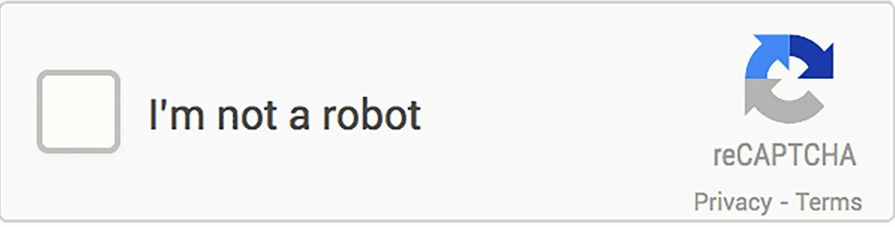

<h1 align="center">
  Oi, povo! Meu nome é Tiago Alves
  
</h1>

<h3 align="center">Desenvolvedor de Software</h3>

 

## Sobre mim: 

🧓 17 anos

📚 Estudante de ADS e técnico de DS

🗣 Inglês fluente

☕ Alto consumidor de café

 

## 🌐 Contato:

 

## 💻 Habilidades: 
### 🎖️ Tenho experiência com

 

### 📚 Ferramentas adicionais

          
   

  
  

