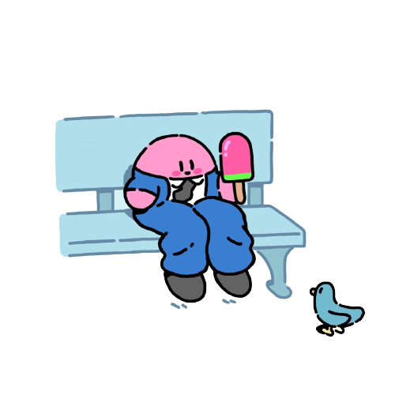

 

<h2 align="center">
  Oi, povo! Meu nome é Tiago Alves
  
</h2>

<h3 align="center">Desenvolvedor de Sistemas</h3>

  

  

  <h2> Sobre mim: </h2> 

  🧓 17 anos

  📚 Estudante de ADS e técnico de DS

  🗣 Inglês fluente

  ☕ Alto consumidor de café

  

 

  

  

    <h2> 💻 Habilidades: </h2> 
    <h2> 🎖️ Tenho experiência com </h2>
    

      
      
      
      
      
      <!-- 
       -->
      
      
      
      <!--  -->
    

    <h2> 📚 Ferramentas adicionais </h2>
    

      
      
      
      
    

  

  

  

  

    
    
  

 

  

  

    <h2> 🌐 Contato: </h2>
    
    
  

   

<!-- <h1 align="center"> Obrigado por passar por aqui! </h1> -->